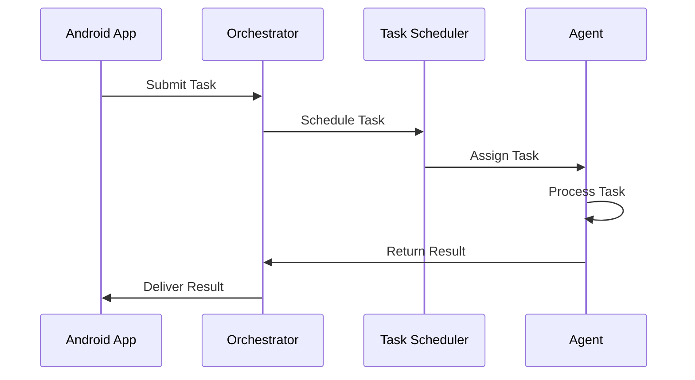

# MCP Architecture Overview



## Table of Contents



[↩️ Back to Documentation Index](/docs/)

## Overview

The Multi-Agent Control Platform (MCP) is a distributed system designed to streamline and automate Android UVC camera development processes. It employs a Finite State Machine (FSM) architecture with a central orchestrator that manages specialized agents through a lightweight messaging system.

This document provides a high-level overview of the system architecture, guiding principles, and references to detailed component specifications.

## Key Architecture Goals

The MCP architecture aims to achieve the following objectives:

1. **Development Acceleration**: Automate repetitive tasks in camera integration
2. **Consistent Quality**: Standardize UVC camera implementation patterns
3. **Developer Productivity**: Reduce cognitive load through specialized agents
4. **Integration Flexibility**: Allow seamless Android app integration
5. **Resource Efficiency**: Optimize for operation on a developer machine
6. **Resilience**: Provide robust error handling and recovery mechanisms
7. **Observability**: Enable comprehensive monitoring and diagnostics

## System Architecture Diagram

```
┌─────────────────────────────────────────────────────────────────┐
│                        Android Application                       │
└───────────────────────────┬─────────────────────────────────────┘
                            │ HTTP/WebSocket
                            ▼
┌─────────────────────────────────────────────────────────────────┐
│                       MCP Core Orchestrator                      │
│  ┌─────────────────┐   ┌──────────────────┐  ┌───────────────┐  │
│  │      FSM        │◄─►│  Task Scheduler  │◄─►│Event Processor│  │
│  └─────────────────┘   └──────────────────┘  └───────────────┘  │
└───────────────────────────┬─────────────────────────────────────┘
                            │ NATS Messaging
                            ▼
┌─────────────────────────────────────────────────────────────────┐
│                       Specialized Agents                         │
│  ┌─────────────────┐ ┌────────────┐ ┌───────────┐ ┌──────────┐  │
│  │   Camera        │ │    Code    │ │   Build   │ │  Testing │  │
│  │ Integration     │ │ Generation │ │  System   │ │          │  │
│  └─────────────────┘ └────────────┘ └───────────┘ └──────────┘  │
│                                                                  │
│  ┌─────────────────┐ ┌────────────┐ ┌───────────────────────┐   │
│  │   Static        │ │Documentation│ │      Future Agents... │   │
│  │  Analysis       │ │             │ │                       │   │
│  └─────────────────┘ └────────────┘ └───────────────────────┘   │
└─────────────────────────────────────────────────────────────────┘
```

## Core Components

### 1. Core Orchestrator

The Orchestrator serves as the central coordination point for all agents in the system:

- **FSM Engine**: Manages system state transitions and agent lifecycles
- **Task Scheduler**: Prioritizes and distributes tasks to appropriate agents
- **Event Processor**: Handles external events from Android app and internal events

[Detailed Specification](/architecture/orchestrator-nats-integration/)

### 2. Agent Framework

The agent framework defines the common structure and behavior for all specialized agents:

- **Base Agent Interface**: Standardized contract for all agents
- **Agent State Management**: Finite state machine for agent lifecycle
- **Agent Capabilities**: Declarative approach to agent functionality

[Detailed Specification](/architecture/fsm-agent-interfaces/)

### 3. Specialized Agents

Initial agent implementations include:

- **Camera Integration Agent**: Manages USB UVC device communication
- **Code Generation Agent**: Generates boilerplate code for camera integration
- **Build System Agent**: Interfaces with Gradle/AGP for build optimization
- **Testing Agent**: Automates testing of camera functionality

[Camera Agent Specification](/architecture/camera-integration-agent/)

### 4. NATS Messaging Infrastructure

NATS provides lightweight pub/sub messaging between components:

- **Topic Structure**: Hierarchical organization of messaging topics
- **Message Schema**: Structured message formats for different interactions
- **Connection Management**: Robust connection handling with reconnection

[Detailed Specification](/architecture/orchestrator-nats-integration/)

### 5. Health Monitoring Framework

Ensures system stability and provides visibility into component health:

- **Health Monitoring Service**: Regularly checks component health
- **System Metrics Collection**: Gathers performance metrics
- **Resilience Mechanisms**: Circuit breakers, retry policies, and supervisors

[Detailed Specification](/architecture/health-monitoring-framework/)

## Design Principles

The MCP architecture follows these key design principles:

1. **Loose Coupling**: Components communicate through well-defined interfaces and messaging
2. **Single Responsibility**: Each component has a clear, focused purpose
3. **Resilience by Design**: Built-in fault tolerance and recovery mechanisms
4. **Observable System**: Comprehensive monitoring and health reporting
5. **Resource Efficiency**: Optimized for operation on a developer machine

## Communication Patterns

### Inter-Component Communication

The primary communication patterns in the MCP architecture are:

1. **Command Pattern**: Direct instructions to agents (e.g., task assignments)
2. **Event Sourcing**: Recording state transitions for tracking and recovery
3. **Request-Reply**: Synchronous operations requiring responses
4. **Pub-Sub**: Asynchronous event notifications

### Message Flow Examples

#### Task Execution Flow



## Technology Choices

- **Core Language**: Kotlin for type safety, conciseness, and coroutine support
- **Messaging**: NATS for lightweight, high-performance pub/sub messaging
- **State Management**: Tinder's StateMachine for FSM implementation
- **Concurrency**: Kotlin Coroutines for non-blocking operations
- **Logging**: SLF4J with Logback for structured logging
- **Serialization**: Kotlin Serialization for type-safe messaging

## Implementation Phases

The MCP implementation is divided into distinct phases:

### Phase 1: Core Infrastructure

1. Set up Kotlin project with Gradle
2. Implement basic FSM and agent framework
3. Create simple orchestrator with NATS messaging
4. Build health check and monitoring components

[Phase 1 Implementation Roadmap](/project/implementation-roadmap/)

### Phase 2: Specialized Agents

1. Develop Camera Integration Agent
2. Implement Code Generation Agent
3. Create Build System Agent
4. Set up Testing Agent

### Phase 3: Android Integration

1. Develop Android SDK for MCP communication
2. Implement camera app integration examples
3. Set up automated testing pipeline
4. Create documentation generation workflow

## Architectural Considerations

### Scalability

While the initial design focuses on a single developer environment, the architecture considers future scalability:

- **Agent Distribution**: Agents can potentially run on separate machines
- **Message Broker**: NATS supports clustering for higher throughput
- **Resource Management**: Task scheduling can adapt to available resources

### Security

Security considerations in the architecture include:

- **Input Validation**: Validating all inputs from external sources
- **Resource Protection**: Preventing resource exhaustion
- **Secure Defaults**: Applying principle of least privilege
- **Error Handling**: Avoiding information leakage in error messages

### Performance

Performance optimizations include:

- **Non-blocking I/O**: Using coroutines for efficient I/O operations
- **Resource Limits**: Constraining concurrent operations to match hardware
- **Efficient Serialization**: Using Kotlin Serialization for messaging
- **Backpressure**: Implementing flow control for task submission

## Known Limitations

The architecture has some known limitations:

1. **Single Orchestrator**: Current design has a single point of coordination
2. **Local Environment Focus**: Primarily designed for local development
3. **Language Coupling**: Core components are Kotlin-specific
4. **Startup Dependencies**: Requires NATS server to be running

For details and mitigations, see the [Issues Registry](/project/issues-registry/).

## Architecture Decision Records

Key architecture decisions are documented in ADRs:

1. [ADR-0001: Kotlin as Primary Language](/architecture/decision-records/0001-kotlin-selection/)
2. [ADR-0002: NATS for Messaging](/architecture/decision-records/0002-nats-messaging/)

## Related Components

For detailed component specifications, refer to:

- [FSM and Agent Interfaces](/architecture/fsm-agent-interfaces/)
- [Orchestrator and NATS Integration](/architecture/orchestrator-nats-integration/)
- [Camera Integration Agent](/architecture/camera-integration-agent/)
- [Health Monitoring Framework](/architecture/health-monitoring-framework/)

## Future Extensions

The architecture supports future extensions:

1. **Additional Specialized Agents**: For new capabilities
2. **Enhanced Monitoring**: More comprehensive metrics and alerting
3. **Remote Agent Support**: For distributed execution
4. **Workflow Orchestration**: More complex task dependencies
5. **ML-Based Analysis**: For camera image processing

## Implementation Progress

Current implementation progress across major components:

| Component | Status | Completion |
|-----------|--------|------------|
| Core Orchestrator | 🟢 Active |  |
| Agent Framework | 🟢 Active |  |
| NATS Integration | 🟢 Active |  |
| Camera Agent | 🟡 Draft |  |
| Health Monitoring | 🟡 Draft |  |

## Conclusion

The Multi-Agent Control Platform architecture provides a solid foundation for building a flexible, resilient system for Android UVC camera development. By following the component specifications and implementation roadmap, developers can create a system that streamlines camera integration, code generation, and testing processes.

The modular design allows for incremental implementation and future extension with additional specialized agents as requirements evolve.

## Related Documentation

