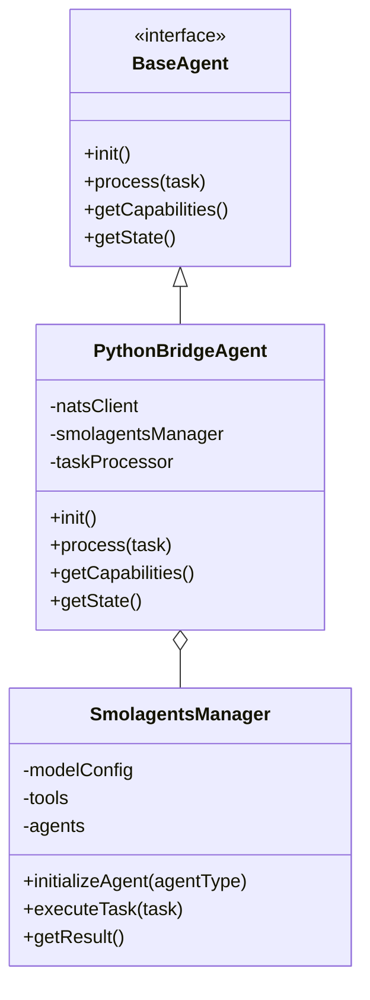
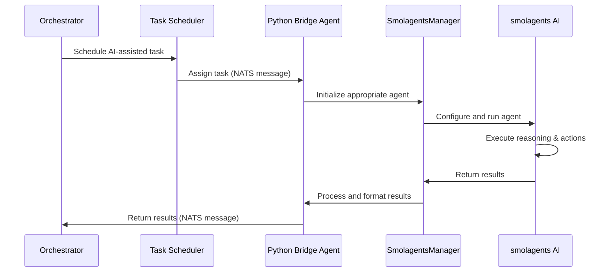

# Integration Report: Python-based AI Agent Bridge with smolagents Framework

🟡 **Draft**

## Executive Summary

This report proposes integrating Hugging Face's smolagents framework into the existing MCP architecture through a non-intrusive Python Bridge Agent approach. This integration enhances our system with AI-powered code generation, analysis, and testing capabilities while preserving the core Kotlin-based architecture.

## Background and Rationale

The smolagents framework provides lightweight, code-centric AI agent capabilities that can enhance several aspects of our Android UVC camera development workflow. By implementing a specialized bridge agent, we can leverage smolagents' strengths without restructuring our existing architecture.

Key benefits include:
- Enhanced code generation capabilities for camera integration
- AI-assisted testing and analysis
- Improved developer productivity through automated assistance
- Future extensibility for additional AI agent capabilities

## Architecture Integration Design

### 1. Integration Architecture

The proposed integration maintains the core MCP architecture while adding an AI-powered layer:

```
┌─────────────────────────────────────────────────────────────────┐
│                       MCP Core Orchestrator                      │
│  ┌─────────────────┐   ┌──────────────────┐  ┌───────────────┐  │
│  │      FSM        │◄─►│  Task Scheduler  │◄─►│Event Processor│  │
│  └─────────────────┘   └──────────────────┘  └───────────────┘  │
└───────────────────────────┬─────────────────────────────────────┘
                            │ NATS Messaging
                            ▼
┌─────────────────────────────────────────────────────────────────┐
│                       Specialized Agents                         │
│  ┌─────────────────┐ ┌────────────┐ ┌───────────┐ ┌──────────┐  │
│  │   Camera        │ │    Code    │ │   Build   │ │  Testing │  │
│  │ Integration     │ │ Generation │ │  System   │ │          │  │
│  └─────────────────┘ └────────────┘ └───────────┘ └──────────┘  │
│                                                                  │
│  ┌──────────────────────────────────────────────────────────┐   │
│  │                Python AI Bridge Agent                     │   │
│  │  ┌───────────────────┐  ┌────────────────────────────┐   │   │
│  │  │ NATS Python Client│  │     smolagents Framework    │   │   │
│  │  └───────────────────┘  └────────────────────────────┘   │   │
│  │                                                          │   │
│  │  ┌───────────────────────────────────────────────────┐  │   │
│  │  │               Specialized AI Tools                 │  │   │
│  │  │  ┌────────────┐  ┌────────────┐  ┌────────────┐   │  │   │
│  │  │  │    Code    │  │    UVC     │  │Documentation│   │  │   │
│  │  │  │Generation  │  │  Analysis  │  │  Generation │   │  │   │
│  │  │  └────────────┘  └────────────┘  └────────────┘   │  │   │
│  │  └───────────────────────────────────────────────────┘  │   │
│  └──────────────────────────────────────────────────────────┘   │
└─────────────────────────────────────────────────────────────────┘
```

### 2. Component Design

The Python AI Bridge Agent follows our existing agent framework patterns:



### 3. Communication Flow

The Python Bridge Agent communicates with the MCP system through the existing NATS messaging infrastructure:



## Implementation Plan

### 1. Directory Structure

The Python Bridge Agent will be integrated into the MCP project structure:

```
/mcp-project/
├── agents/
│   ├── camera-agent/
│   ├── ... (existing agents)
│   └── python-bridge/            # New Python Bridge Agent
│       ├── README.md             # Agent documentation
│       ├── pyproject.toml        # Python project configuration
│       ├── requirements.txt      # Dependencies
│       ├── src/
│       │   ├── bridge/           # Bridge implementation
│       │   │   ├── __init__.py
│       │   │   ├── nats_client.py
│       │   │   └── agent.py      # Main agent implementation
│       │   ├── smolagents/       # smolagents integration
│       │   │   ├── __init__.py
│       │   │   ├── manager.py
│       │   │   └── tools/        # Custom tools
│       │   │       ├── __init__.py
│       │   │       ├── code_generation.py
│       │   │       ├── documentation.py
│       │   │       └── uvc_analysis.py
│       │   └── config/           # Configuration files
│       │       ├── __init__.py
│       │       └── models.py
│       └── tests/                # Test suite
│           ├── __init__.py
│           ├── test_bridge.py
│           └── test_tools.py
└── docs/
    └── architecture/
        └── python-bridge-agent-spec.md  # New specification document
```

### 2. Core Implementation Components

#### 2.1 Bridge Implementation

The core `agent.py` will implement our existing agent interface:

```python
from nats.aio.client import Client as NATS
from smolagents import CodeAgent, HfApiModel

class PythonBridgeAgent:
    """Python Bridge Agent that implements the MCP Agent interface."""
    
    def __init__(self, nats_server="nats://localhost:4222"):
        self.nats_client = NATS()
        self.nats_server = nats_server
        self.smolagents_manager = None
        self.state = "INITIALIZING"
        
    async def init(self):
        """Initialize the agent and connect to NATS."""
        await self.nats_client.connect(self.nats_server)
        await self.nats_client.subscribe("agent.python-bridge.>", cb=self.message_handler)
        self.smolagents_manager = SmolagentsManager()
        self.state = "READY"
        
    async def message_handler(self, msg):
        """Handle incoming NATS messages."""
        subject = msg.subject
        data = json.loads(msg.data.decode())
        task_type = subject.split(".")[-1]
        
        result = await self.process_task(task_type, data)
        
        # Publish result back
        response_subject = f"agent.response.{data['task_id']}"
        await self.nats_client.publish(response_subject, json.dumps(result).encode())
    
    async def process_task(self, task_type, data):
        """Process a task using the appropriate smolagents agent."""
        return await self.smolagents_manager.execute_task(task_type, data)
```

#### 2.2 SmolagentsManager Implementation

The manager handles smolagents initialization and execution:

```python
from smolagents import CodeAgent, HfApiModel
from .tools import CodeGenerationTool, DocumentationTool, UvcAnalysisTool

class SmolagentsManager:
    """Manages smolagents agents and tools."""
    
    def __init__(self, model_name="Qwen/Qwen2.5-Coder-32B-Instruct"):
        self.model = HfApiModel(model_id=model_name)
        self.tools = {
            "code_generation": CodeGenerationTool(),
            "documentation": DocumentationTool(),
            "uvc_analysis": UvcAnalysisTool()
        }
        self.agents = {}
    
    def get_agent(self, task_type):
        """Get or create an agent for the specified task type."""
        if task_type not in self.agents:
            if task_type == "code_generation":
                self.agents[task_type] = CodeAgent(
                    tools=[self.tools["code_generation"]],
                    model=self.model
                )
            elif task_type == "documentation":
                self.agents[task_type] = CodeAgent(
                    tools=[self.tools["documentation"]],
                    model=self.model
                )
            # Add other agent types as needed
        
        return self.agents[task_type]
    
    async def execute_task(self, task_type, data):
        """Execute a task using the appropriate agent."""
        agent = self.get_agent(task_type)
        prompt = self.build_prompt(task_type, data)
        
        try:
            result = agent.run(prompt)
            return {
                "status": "success",
                "result": result,
                "task_id": data["task_id"]
            }
        except Exception as e:
            return {
                "status": "error",
                "error": str(e),
                "task_id": data["task_id"]
            }
    
    def build_prompt(self, task_type, data):
        """Build a prompt for the specified task type."""
        if task_type == "code_generation":
            return f"Generate Android UVC camera integration code with the following requirements:\n{data['requirements']}"
        elif task_type == "documentation":
            return f"Generate documentation for the following code:\n{data['code']}"
        # Add other prompt types as needed
```

#### 2.3 Custom Tools Implementation

Example of a custom tool for code generation:

```python
from smolagents import tool
from typing import Optional

@tool
def generate_uvc_camera_code(
    camera_name: str,
    resolution: str,
    format: str,
    additional_features: Optional[str] = None
) -> str:
    """
    Generates Android UVC camera integration code based on specifications.
    
    Args:
        camera_name: Name of the camera device
        resolution: Desired resolution (e.g., '640x480')
        format: Video format (e.g., 'MJPEG', 'YUY2')
        additional_features: Optional features to include
        
    Returns:
        String containing generated Kotlin code for camera integration
    """
    # This function will be called by the smolagents CodeAgent
    # The agent will write Python code that uses this function
    pass
```

### 3. Integration with Existing MCP Components

#### 3.1 Orchestrator Integration

Update the core orchestrator to recognize and route tasks to the Python Bridge Agent:

```kotlin
// Add to TaskRouterImpl.kt
override fun routeTask(task: Task): AgentRef {
    return when (task.type) {
        "code-generation" -> agentRegistry.getAgent("python-bridge")
        "documentation-generation" -> agentRegistry.getAgent("python-bridge")
        "uvc-analysis" -> agentRegistry.getAgent("python-bridge")
        // Existing routing logic
        else -> super.defaultRouting(task)
    }
}
```

#### 3.2 Task Schema Updates

Add new task schemas for AI-assisted operations:

```kotlin
// Add to TaskSchemas.kt
val CodeGenerationTask = TaskSchema(
    type = "code-generation",
    properties = mapOf(
        "requirements" to PropertySchema(type = "string", required = true),
        "targetPackage" to PropertySchema(type = "string", required = true),
        "cameraType" to PropertySchema(type = "string", required = true)
    )
)

val DocumentationGenerationTask = TaskSchema(
    type = "documentation-generation",
    properties = mapOf(
        "code" to PropertySchema(type = "string", required = true),
        "targetFormat" to PropertySchema(type = "string", required = true),
        "docType" to PropertySchema(type = "string", required = true)
    )
)
```

## Implementation Phases

### Phase 1: Core Infrastructure (Weeks 1-2)

1. Set up Python project structure
2. Implement NATS client integration
3. Create basic smolagents manager
4. Develop initial code generation tool
5. Create integration tests

### Phase 2: Advanced Tools (Weeks 3-4)

1. Implement UVC camera analysis tools
2. Add documentation generation capabilities
3. Integrate with existing code generation agent
4. Develop comprehensive test suite

### Phase 3: Orchestration and UI (Weeks 5-6)

1. Enhance orchestrator integration
2. Create agent health monitoring
3. Add UI components for AI agent interaction
4. Prepare documentation and examples

## Technical Challenges and Mitigations

| Challenge | Mitigation |
|-----------|------------|
| **Language Barrier** | Use strongly typed JSON schemas for Kotlin-Python communication |
| **Performance Overhead** | Implement asynchronous processing and result caching |
| **NATS Connection Stability** | Add robust reconnection logic and health check mechanisms |
| **Model Availability** | Support multiple model options including local models for offline development |
| **Security Concerns** | Implement sandboxed execution for generated code and strict input validation |

## Documentation Updates

The following documentation updates will be required:

1. New architecture specification document
2. Updates to the orchestrator documentation
3. Python Bridge Agent user guide
4. Example workflows incorporating AI assistance
5. Development environment setup guide for Python components

## Success Metrics

We will measure the success of this integration through:

1. **Developer Productivity**: Time saved in camera integration tasks
2. **Code Quality**: Reduction in defects in generated code
3. **Documentation Completeness**: Improvement in documentation coverage
4. **Agent Adoption**: Usage statistics for AI-assisted tasks

## Future Extensions

This integration lays the groundwork for future enhancements:

1. **Additional AI Agents**: Specialized agents for UI generation, testing, etc.
2. **LLM Fine-tuning**: Custom-trained models for camera-specific tasks
3. **Multi-modal Capabilities**: Adding vision capabilities for analyzing camera output
4. **Workflow Automation**: Complete end-to-end automation of camera integration

## Conclusion

The proposed Python Bridge Agent integration provides a balanced approach to enhancing our MCP architecture with AI capabilities while preserving our investment in the existing Kotlin-based system. By following this plan, we can incrementally introduce powerful AI assistance for Android UVC camera development with minimal disruption to the current architecture.

## Next Steps

1. Review and approve this integration plan
2. Schedule technical planning session
3. Allocate resources for Phase 1 implementation
4. Establish integration milestones and checkpoints

---

## Appendix A: Environment Setup

### Python Environment Setup

```bash
# From the MCP implementation directory
cd agents/python-bridge

# Create virtual environment
python -m venv .venv
source .venv/bin/activate  # On Windows: .venv\Scripts\activate

# Install dependencies
pip install -r requirements.txt
```

### Required Dependencies

```
# requirements.txt
smolagents>=1.0.0
nats-py>=2.2.0
pydantic>=2.0.0
pytest>=7.0.0
pytest-asyncio>=0.20.0
```

## Appendix B: Testing Strategy

The testing strategy will include:

1. **Unit Tests**: For individual Python components
2. **Integration Tests**: Between Python and NATS
3. **End-to-End Tests**: Complete workflows from orchestrator to AI agent
4. **Performance Tests**: Measure latency and throughput

Example test case:

```python
# test_bridge.py
import pytest
import json
from unittest.mock import MagicMock, patch
from src.bridge.agent import PythonBridgeAgent

@pytest.mark.asyncio
async def test_process_task():
    # Arrange
    agent = PythonBridgeAgent()
    manager_mock = MagicMock()
    manager_mock.execute_task.return_value = {"status": "success", "result": "Generated code"}
    agent.smolagents_manager = manager_mock
    
    # Act
    result = await agent.process_task("code_generation", {
        "task_id": "test-123",
        "requirements": "Test camera integration"
    })
    
    # Assert
    assert result["status"] == "success"
    manager_mock.execute_task.assert_called_once()
```

## Appendix C: References

- [MCP Architecture Overview](/mcp-project/docs/architecture/overview.md)
- [FSM Agent Interfaces](/docs/architecture/fsm-agent-interfaces.md)
- [Orchestrator NATS Integration](/docs/architecture/orchestrator-nats-integration.md)
- [smolagents GitHub Repository](https://github.com/huggingface/smolagents)
- [NATS Python Client Documentation](https://github.com/nats-io/nats.py)

---