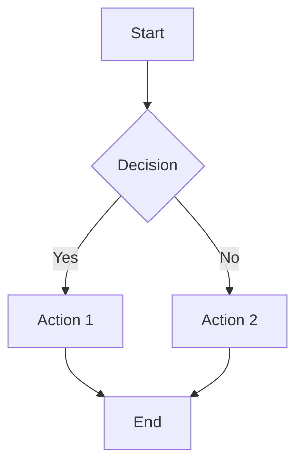

# Documentation Guidelines

[↩️ Back to Documentation Index](/docs/README.md)

## Overview

This document establishes the standards and best practices for creating and maintaining documentation for the Multi-Agent Control Platform (MCP). Following these guidelines ensures that our documentation remains consistent, accessible, and valuable throughout the project lifecycle.

## Document Structure

### Standard Sections

All technical documents should include these sections where applicable:

1. **Overview**: Brief introduction to the document's purpose and content
2. **Prerequisites**: Any information or setup required before using the document
3. **Main Content**: The primary technical information (architecture, implementation, etc.)
4. **Examples**: Practical examples demonstrating key concepts
5. **Troubleshooting**: Common issues and their solutions
6. **Related Documents**: Links to related information
7. **Glossary**: Definitions of domain-specific terms (if needed)

### Technical Specification Structure

Architecture and component specification documents should follow this structure:

1. **Component Overview**: Purpose and role in the system
2. **Core Interfaces/Classes**: Key code structures with explanations
3. **Behavior**: How the component functions, including state transitions
4. **Communication**: How the component interacts with other components
5. **Data Models**: Essential data structures
6. **Implementation Guidelines**: Best practices for implementation
7. **Known Limitations**: Documented constraints or issues

## Metadata and Front Matter

Every document must begin with YAML front matter containing:

```yaml
---
title: "Document Title"
status: "Active"  # Active, Draft, Review, Outdated, or Archived
version: "1.0"    # Semantic versioning
date_created: "YYYY-MM-DD"
last_updated: "YYYY-MM-DD"
contributors: ["Name"]
related_docs:
  - "/docs/path/to/related/document.md"
tags: ["tag1", "tag2"]
---
```

## Documentation Status Lifecycle

Documents follow this lifecycle:

1. **Draft** 🟡: Initial creation, content may change substantially
2. **Review** 🟠: Complete but pending final approval
3. **Active** 🟢: Current, approved documentation
4. **Outdated** 🔴: No longer current but not yet updated
5. **Archived** ⚫: Historical information, no longer applicable

Status should be updated in the front matter whenever the document status changes.

## Status Indicators

Include status indicators at the beginning of each document:

- 🟢 **Active**: `🟢 **Active**`
- 🟡 **Draft**: `🟡 **Draft**`
- 🟠 **Review**: `🟠 **Review**`
- 🔴 **Outdated**: `🔴 **Outdated**`
- ⚫ **Archived**: `⚫ **Archived**`

## Cross-Referencing

### Internal Links

Use relative links to reference other documents:

```markdown
[Document Title](/docs/path/to/document.md)
```

### External Links

For external references, include the full URL and describe the target:

```markdown
[External Service Documentation](https://example.com/docs) - Official documentation for Example Service
```

### Issue References

When referencing known issues, include a link to the Issues Registry:

```markdown
This component has a [known performance issue](/docs/project/issues-registry.md#ISSUE-123) with large datasets.
```

## Code Samples

### Formatting

Format code samples with appropriate language identifiers:

```kotlin
fun example() {
    println("This is a Kotlin code sample")
}
```

### Inline Code

Use backticks for inline code references: `McpAgent`.

## Diagrams

### Guidelines

- Use ASCII diagrams for simple flowcharts in Markdown
- Create complex diagrams using Mermaid or PlantUML
- Store diagram source in the document for future editing
- Keep diagrams focused on one concept per visual

### Example Mermaid Diagram



## Images

- Store images in `/docs/assets/images/`
- Use descriptive filenames: `component-state-diagram.png`
- Include alt text for accessibility: ``
- Keep images below 1MB in size
- Provide image source files when available

## Tables

Use tables for structured information:

| Column 1 | Column 2 |
|----------|----------|
| Data 1   | Data 2   |
| Data 3   | Data 4   |

## Document Naming Conventions

- Use lowercase kebab-case: `fsm-agent-interfaces.md`
- Be descriptive but concise
- Group related documents with common prefixes
- Avoid special characters except hyphens

## Version Control

### Version Numbers

Use semantic versioning for documents:

- **Major version** (1.0.0): Substantial content changes
- **Minor version** (0.1.0): Additions/improvements without major structural changes
- **Patch version** (0.0.1): Small corrections or clarifications

### Changelogs

For significant documents, maintain a changelog at the end:

```markdown
## Changelog

- 1.1.0 (2025-03-25): Added section on error handling
- 1.0.0 (2025-03-22): Initial release
```

## Known Issues and Pitfalls

Document known issues directly in relevant technical documents and in the [Issues Registry](/docs/project/issues-registry.md).

For each issue include:

1. Issue ID and descriptive title
2. Impact on functionality or development
3. Workarounds or mitigation strategies
4. Status (open, under investigation, resolved)
5. Related components or documents

## Documentation Review Process

1. Author creates document in Draft status
2. Internal review by technical team
3. Updates based on feedback
4. Final review by Documentation Architect
5. Status changed to Active when approved
6. Periodic reviews to maintain freshness

## Future Hugo Migration Considerations

- Use Hugo-compatible Markdown syntax
- Follow Hugo front matter formatting
- Organize content to match Hugo's content structure
- Use standard Markdown image links
- Minimize custom HTML unless necessary

## Documentation Templates

Templates for common document types are located in `/docs/templates/`:

- [Architecture Component Template](/docs/templates/architecture-component-template.md)
- [Implementation Guide Template](/docs/templates/implementation-guide-template.md)
- [API Documentation Template](/docs/templates/api-documentation-template.md)

## Accessibility Guidelines

- Use proper heading hierarchy (H1, H2, etc.)
- Provide alt text for all images
- Use sufficient color contrast
- Avoid conveying information through color alone
- Use descriptive link text instead of "click here"

## Contribution Flow

1. Identify documentation need
2. Check if similar documentation exists
3. Create or update document following these guidelines
4. Add appropriate front matter and metadata
5. Submit for review
6. Address feedback
7. Update status when approved